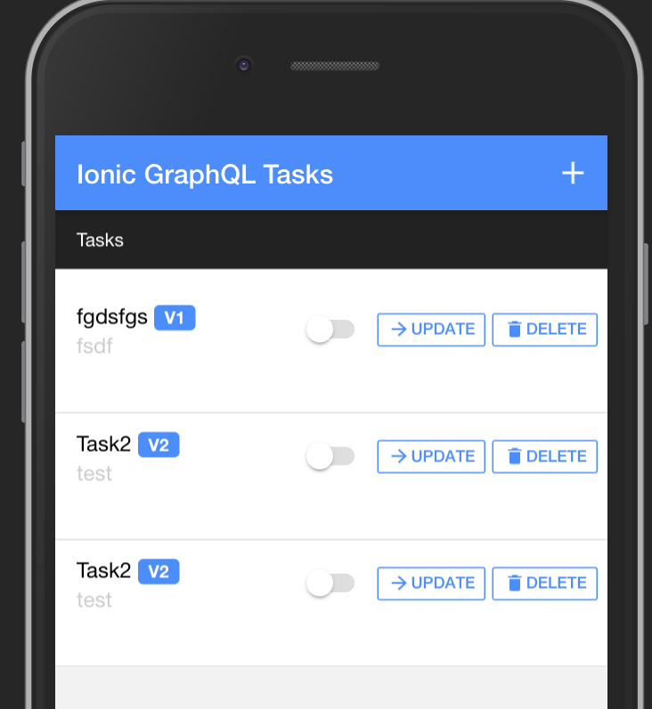

## AeroGear Apollo Voyager Example app

Example application using Apollo GraphQL, Ionic and Cordova libraries

## Implementation

Implementation include:

- Ionic4 Angular frontend backed by Cordova/Capacitor for mobile deployment
- Apollo GraphQL Node.JS server implementing sample `Tasks` API

### GraphQL Client

Application using [Apollo Voyager Client](https://github.com/aerogear/aerogear-js-sdk/tree/master/packages/sync) to provide additional offline capabilities on top of the Apollo GraphQL 

### GraphQL Server

Application using [Apollo Voyager Server](https://github.com/aerogear/apollo-voyager-server) to provide GraphQL capabilities along with security, monitoring and tools to simplify GraphQL API development.

## Running example

Requirements:

- Docker
- Node.js 6.x or above to run server

### Running the server

1. Start the PostgreSQL docker image

   ```shell
   cd ./server
   docker-compose up -d
   ```

1. Start the server

   ```shell
   npm install
   npm run start
   ```

### Running the client


1. Install Ionic

   ```shell
   npm install -g ionic
   ```

1. Install this Ionic 4 starter app

   ```shell
   npm install
   ```

1. Browse Ionic 4 app
   
   ```shell
   npm run start
   ```

1. Alternatively - Run as mobile application on Android platform.

   ```shell
   npm run ionic:android
   ```

> NOTE: To connect to the server running on local machine on Android emulator 
please change [Client URL](https://github.com/aerogear/apollo-voyager-ionic-example/blob/master/src/app/services/voyager.service.ts#L42) from `localhost` to `10.0.2.2` 

### Demo


