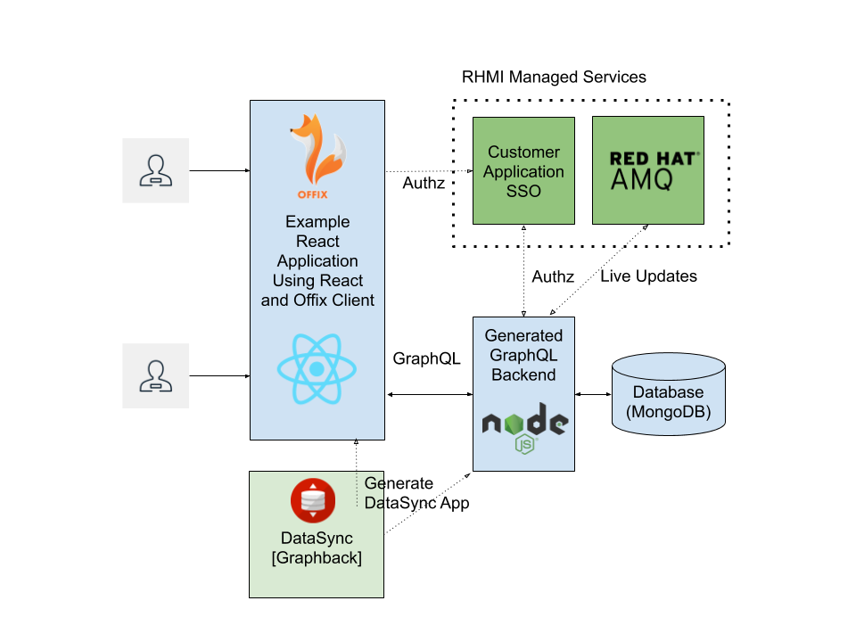

// update the component versions for each release
:rhmi-version: 1

// URLs
:openshift-console-url: {openshift-host}/console
:sso-realm-url: {user-sso-url}/auth/admin/solution-patterns/console/index.html
:data-sync-documentation-url: https://access.redhat.com/documentation/en-us/red_hat_managed_integration/{rhmi-version}/html-single/developing_a_data_sync_app/index

//attributes
:integreatly-name: Managed Integration
:data-sync-name: Data Sync
:data-sync-starter: Data Sync Starter
:customer-sso-name: SSO
:standard-fail-text: Verify that you followed all the steps. If you continue to have issues, contact your administrator.

//id syntax is used here for the custom IDs because that is how the Solution Explorer sorts these within groups
[id='5-adding-data-sync-graphql']
= Creating your Data Sync Application in CodeReady

// word count that fits best is 15-22, with 20 really being the sweet spot. Character count for that space would be 100-125
Learn how to build applications that can perform realtime data synchronization with DataSync and GraphQL.

This solution pattern will show you how to:

* Build a DataSync server based on your business model
* Protect the application's frontend and backend using {customer-sso-name}.
* Explore all the capabilities provided by {data-sync-name}.

The following diagram shows the architecture of the {data-sync-starter}:

[type=walkthroughResource, serviceName=openshift]
.Red Hat OpenShift
****
* link:{openshift-console-url}[Console, window="_blank"]
* link:https://docs.openshift.com/dedicated/4/welcome/index.html/[OpenShift Documentation, window="_blank"]
* link:https://blog.openshift.com/[OpenShift Blog, window="_blank"]
****

[type=walkthroughResource]
.Data Sync
****
* link:{data-sync-documentation-url}[Getting Started with {data-sync-name}, window="_blank"]
****

:sectnums:

[time=15]
== Creating your DataSync project using DataSync Starter template

{data-sync-name} allows you to focus on your business model by giving you the ability
to generate a fully functional GraphQL based API and Node.js Server and Client Side components.

Developers can use GraphQL types to define the models their application deals with
and generate the underlying backend that works out of the box with the RHMI services like SSO or AMQ Online.

Using GraphQL subscriptions, your application can receive live updates thanks to GraphQL and the DataSync client allows your application to operate independently of the network connection. 

DataSync-Starter is an application template that gives developers 
opiniated implementation for React Ionic PWA and Mobile application backend by Node.js Server.

DataSync as framework consist of the two major components:

* DataSync client (upstream https://offix.dev) 
+
Can be added to any web or mobile application
to provide DataSynchronization capabilities

* Node.js Server with code generation capabilties (upstream https://graphback.dev) 
+
Server is providing ability to dynamically generate Node.js GraphQL server with DataSynchronization and Conflict resolution capabilties 

[time=30]
=== Setting your DataSync project using in CodeReady

In this section we will use CodeReady Workspaces as a development environment to work with the DataSync Starter project.

. Navigate to the solution explorer
. Go to the "All Services" tab 
. Go to "Online IDE" and select "Open Console"
. Login to the CodeReady Workspaces dashboard
. Choose `NodeJS MongoDB Web Application` from list of the available stacks
. Enter `https://github.com/aerogear/datasync-starter#walkthrough` for the repository URL
. In the right corner press down arrow and select `Create and Start Editing`
. In the new window select the `Dev File` tab and the copy dev file from 
https://raw.githubusercontent.com/aerogear/datasync-starter/master/devfile.yaml
. Press `Create`
. Wait for the workspace to start
. Press `Open` to open CodeReady editor
. In the active workspace, run the `Install dependencies` command.
+
The commands are listed in the `MyWorkspace` view available by selecting the box icon in the right top corner of the screen.

=== Creating your DataSync model

Based on a user defined **Model** DataSync generates the underlying GraphQL API and database resources.
The starter template uses MongoDB as the default datasource for storing application data.

. In your project explorer view on the left,  go to the `./model/task.graphql` file. 
This file contains an link:https://graphql.org/learn/schema/#object-types-and-fields[GraphQL Schema, window="_blank"]. Here you can define types of the data your application will work with. Graphback will use your model and generate underlying data access methods in the form of GraphQL Queries and Mutations
. Please add a `@datasync` annotation under the `@model` annotation on the `Task` type.
Those annotations control various behaviour of DataSync.
`@model` will create standard data access methods, while `@datasync` will provide data synchronization capabilities.
. Models can be changed by adding new types or fields. Add a new field to the `Task` type by adding `address: String`
. Your task model should be as follows
----
""" 
@model
@datasync
"""
type Task {
  id: ID!
  title: String!
  description: String!
  status: TaskStatus
  address: String
}
----

=== Generating your DataSync Node.JS server and React App

DataSync provides code generation capabilities that transform your model into a fully functional client and server application.
The datasync-starter template contains the following folders:

* `./server`- contains a Node.js server application written in TypeScript. `server/src/index.ts` is the entrypoint to the server application.
* `./client` - contains a React application written in TypeScript. `client/src/index.tsx` is the entrypoint to the client application.
* `.graphqlrc.yml` - 

. Review the `.graphqlrc.yml` file. This is a config file that
** determines what types of CRUD operations will be generated into GraphQL Queries and Mutations in your application.
** enables and configures various plugins that are used during the code generation process.
. Make sure that all fields in the `crud` section are enabled 
. Execute graphback cli command to generate source code:
`yarn graphback generate`. You can also execute it as predefined `generate source code` command in CodeReady
. Review `./server/src/schema/schema.qraphql`. 
This file has the original model and it also contains generated Queries and Mutations. The types of queries and mutations included are based on the `crud` fields in `.graphqlrc.yml`.
. Review the generated resolver files in `./server/src/resolvers/resolvers.ts`
This file contains methods used to fetch and modify data. Each individual method uses a 
preconfigured `MongoDataProvider` which is an abstraction over a MongoDB client. Developers can point resolvers to any datasource.
Currently Postgres and MongoDB are supported.
. Review your `./client/src/graphql/` folder containing client side queries for your data. These queries are automatically generated based on the server schema, and are used within the client application. Generating the client side queries helps developers get their client apps up and running quicker and helps them stay up to date as the server schema evolves.

=== Running DataSync client and server applications

. Open a new terminal window
. Execute the `prepare client` command in the new terminal. Client side application will be build and started. This can take a couple of minutes.
. Execute the `start server` command. This command starts the GraphQL server which also serves the client application for simplicity.
. The application should be opened in a preview window after build is finished.

[type=verification]
****
. Check if the website was loaded properly
. Select the + icon to create a new item
. On the new screen enter a `name` and `description` and create the task.
. New task should appear in the task list.
----
****

[type=verificationFail]
****
Check the logs of the console
Verify that you followed each step in the procedure above.  
If you are still having issues, contact your administrator.
****

=== Interacting with the GraphQL Playground

The GraphQL Playground is an in browser GraphQL IDE that lets you directly perform queries and mutations against your GraphQL API.
It's a convenient way to interact with your GraphQL API without using a client application.
It is served directly by your server application as a developer tool and can be disabled in production.
In this section we will focus on using the playground.

. Open a new terminal window
. Execute `yarn start:server`
. Open the GraphQL Playground URL printed in console.
You can use the GraphQL playground to interact with the server API as described in the next step.
. Go to the Playground interface and replace the text in the left pane of the screen with the following query and mutation:

----
query listTasks {
  allTasks {
    title,
    description,
    address,
    id
  }
}

mutation createTask {
  createTask(title: "complete the walkthrough", description: "complete the GraphQL walkthrough", address: "NA") {
    title,
    description,
    version,
    address,
    id
  }
}
----

[type=verification]
****
. Click the Run icon in the middle of the playground screen.
. Choose `createTask` from the menu.
The system should create a task and the result is displayed in the panel on the right side.
. Choose `listTasks` from the Run menu.
. Check that the following is displayed in the right hand panel:
. You should also see the `address` field that we have added in previous steps.
+
----
{
    "data": {
        "allTasks": [
            {
                "title": "complete the walkthrough",
                "description": "complete the GraphQL walkthrough",
                "id": "1",
                "address": "NA"
            }
        ]
    }
}
----
****

[type=verificationFail]
****
Check the logs of the `ionic-showcase-server` pod.

It should include the string `+connected to messaging service+`.
Verify that you followed each step in the procedure above.  If you are still having issues, contact your administrator.
****

[time=5]
== Running and verifying your DataSync server

The {data-sync-starter} provides:
  
  - Offline operation support
  - Realtime updates through GraphQL Subscriptions
  - Conflict detection and resolution

In this guide we will explore the capabilities of DataSync by using the
generated server application and the sample frontend application available as part of {data-sync-starter}.
The frontend application is a Todo style app that uses the `Task` model.

. Go back to the application opened in the previous step.
. Create a task by clicking on the plus icon in the bottom right-hand side of the screen.
. Add a title and description, of your choosing, to the task and click *Create*.
. Copy the current url and paste it in a different tab, browser or mobile browser.
. Change the status of the task by clicking/unclicking the text box beside the task.

[type=verification]
****
Verify that the status of the task is synced across all tabs in real-time.
****

[type=verificationFail]
****
Verify that you followed each step in the procedure above.  If you are still having issues, contact your administrator.
****

[time=10]
== Exploring data sync features using the Data Sync showcase application

To explore data sync features, you should run multiple instances of the {data-sync-starter} using different browsers.
For example, use the browser on your mobile device as well as using the browser on your laptop.

=== Exploring real-time sync

. On your laptop:
.. Create a new task using *+* icon.
.. Enter some task text  and click *Create*.

. On your second device:
.. Check that the same task appears in the tasks page
.. Make some changes to the task.

. On your laptop:
.. Check that the task changes are synchronized.

[type=verification]
****
Did the tasks appear as expected?
****

[type=verificationFail]
****
Verify that you followed each step in the procedure above.  If you are still having issues, contact your administrator.
****

=== Exploring offline support

DataSync provides offline and conflict resolution for client side applications
like React, Angular or Vue. Sample application implements `Task` model 
generated from server and utilizes Offix (http://offix.dev) client to enable
offline and conflict capabilities.

. On your mobile device:
.. Activate airplane mode or disable network connectivity.
.. Create a new task.
The task should be created and the *Offline Changes* button in the footer should contain one change.
.. Make a few more changes by either editing existing tasks, or creating new ones.
.. Review all the changes by clicking the *Offline Changes* button.

. On your laptop:
You do not see any of the changes from the mobile device.

. On your second device:
.. Restore connectivity or deactivate airplane mode.
.. Watch the status of the tasks change.

. On your laptop:
.. Check that all the tasks are synchronized.

[type=verification]
****
Did the tasks appear as expected?
****

[type=verificationFail]
****
Verify that you followed each step in the procedure above.  If you are still having issues, contact your administrator.
****

=== Resolving conflicts

. On your second device:
.. Create a task `todo A`.
.. Activate airplane mode or disable network connectivity.
.. Edit the task description to add the text `edited on mobile`.

. On your laptop:
.. Simulate offline mode. For example, in Chrome, press F12 to open *Developer Tools* and select *offline* in  the *Network* tab.
.. Edit the `todo A` task, change the text to `todo B`.

. Bring both of your devices back online, the tasks should sync without a conflict.

. On your mobile device:
.. Activate airplane mode or disable network connectivity.
.. Edit task `todo B` change the description to:
+
----
Conflicting description from mobile
----

. On your laptop:
.. Simulate offline mode. For example, in Chrome, press F12 to open *Developer Tools* and select *offline* in  the *Network* tab.
.. Edit task `todo B` change the description to:
+
----
Conflicting description from laptop
----

. Bring both of your devices back online, a popup window should appear warning you about conflicts.

[type=verification]
****
Did the tasks sync as expected?
****

[type=verificationFail]
****
Verify that you followed each step in the procedure above.  If you are still having issues, contact your administrator.
****

. Close terminal window running server application

[time=15]
== Add authentication and authorization to the Data Sync application using Red Hat SSO

In this section, we will configure both the frontend and the backend of the 
{data-sync-starter} with the {customer-sso-name}.

DataSync starter has authentication and autorization enabled out of the box.
Developers need to configure server and client application to use their keycloak instance
and add required authorization rules to their model.

== Add authorization rule for Task deletion

. Go to your GraphQL Schema `./server/src/schema/schema.qraphql`. 
Schema contains mutations section that is responsible for data modifications
. In mutation section find `deleteTask(input: TaskInput): Task!`
. Add GraphQL Directive on top of it `@hasRole(role: "admin")`
This will only allow deletion for admin users.
Roles can be also applied in generation process by utilizing graphback plugin
. This directive is already defined in {data-sync-starter} and can be also applied 
to any new mutation or query created by users.
We going to verify this directive in next steps

=== Configuring Authentication for Keycloak (SSO) 

> NOTE: instructions here might be updated after next release of the RHMI

Please skip this if you have keycloak configured in previous step

. In solution explorer open the User SSO service.
. Login using your own credentials (You might need to open this tab in incognito mode).
. In menu on the left hover over realm name.
. Select `Add new realm`
. Put `DataSync Example` as name and press `Create`
. Select *Clients* from the vertical navigation menu on the left side of the screen.
. Click the *Create* button on the top right of the Clients screen.
. On the *Add Client* screen:
.. In the *Client ID* field, enter
+
[subs="attributes+"]
----
public-datasync
----
.. Verify the *Client Protocol* is set to *openid-connect*.
.. Click *Save*.
. You will see the *Settings* screen for the *{client-name}* client if the save is successful.
. on the *Settings* page:
.. Change `Valid Redirect URIs` to hostname used to run your server application with `*` at the end.
For example `https://routex9wvywuq-codeready-workspaces.apps.openshift.io*`
.. Change `Web Origins` to `*`
.. Click on the *Save* button
.. Click on the *Installation* tab, and select `Keycloak OIDC JSON` format. Copy the content displayed or use the `Download` button to save the configuration file.
. Create new users for testing:
.. Select *Users* on the left menu, and click on *View all users*.
.. Click on *Add user* to create a new user. Pick a username you like for the *Username* field and click *Save*.
.. Select the *Credentials* tab and set a password for this user. Set *Temporary* option to *OFF*.
.. Click *Reset Password*

=== Testing Keycloak Authentication and Authorization

. Close all opened terminals in Code Ready environment
. Copy `Keycloak OIDC JSON` file into:
.. `server/website/keycloak.json`
.. `server/src/config/keycloak.json`
. Execute `start server`. This command will start GraphQL server with embedded client.
. Open Preview URL in the new window
. Login window should appear.
. Login using credentials you have choosen in keycloak
. Press User icon in the top right corner. 
. You should see admin user profile with his roles
. Go back to the task screen
. Try to delete one of the created tasks
. User will not be permitted to delete task as it does not have admin role.
