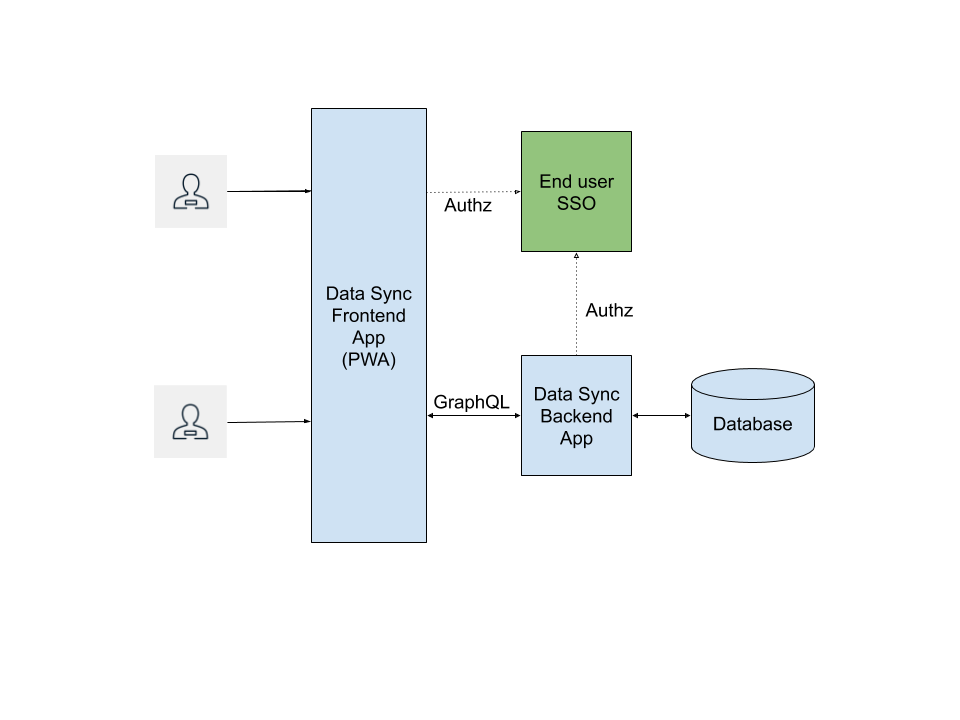

// update the component versions for each release
:rhmi-version: 1

// URLs
:openshift-console-url: {openshift-host}/console
:sso-realm-url: {user-sso-url}/auth/admin/solution-patterns/console/index.html
:data-sync-documentation-url: https://access.redhat.com/documentation/en-us/red_hat_managed_integration/{rhmi-version}/html-single/developing_a_data_sync_app/index

//attributes
:title: Creating your Data Sync Application
:integreatly-name: Managed Integration
:data-sync-name: Data Sync
:data-sync-starter: Data Sync Starter
:customer-sso-name: Customer Application SSO
:realm-name: solution-patterns
:realm-display-name: Solution Patterns
:shared-realm-username: admin
:realm-password: admin
:standard-fail-text: Verify that you followed all the steps. If you continue to have issues, contact your administrator.

//id syntax is used here for the custom IDs because that is how the Solution Explorer sorts these within groups
[id='5-adding-data-sync-graphql']
= {title}

// word count that fits best is 15-22, with 20 really being the sweet spot. Character count for that space would be 100-125
Learn how to build applications that can perform realtime data synchronization with DataSync and GraphQL.

This solution pattern will show you how to:

* Build DataSync server based on your business model
* Protect the application's frontend and backend using {customer-sso-name}.
* Explore all the capabilities provided by {data-sync-name}.

The following diagram shows the architecture of the {data-sync-starter}:

[type=walkthroughResource, serviceName=openshift]
.Red Hat OpenShift
****
* link:{openshift-console-url}[Console, window="_blank"]
* link:https://docs.openshift.com/dedicated/4/welcome/index.html/[OpenShift Documentation, window="_blank"]
* link:https://blog.openshift.com/[OpenShift Blog, window="_blank"]
****

[type=walkthroughResource]
.Data Sync
****
* link:{data-sync-documentation-url}[Getting Started with {data-sync-name}, window="_blank"]
****

:sectnums:

[time=15]
== Creating your DataSync project from DataSync Starter template

{data-sync-name} allows you to focus on your business model by giving you ability
to generate fully functional GraphQL based API and Node.js Server and Client Side components.

DataSync will allow your application to recieve live updates thanks to GraphQL subscriptions and
operate independently of network connection. Developers can create GrapQL types as model 
and generate underlying backend that will work out of the box with the RHMI services like SSO or AMQ Online

[time=30]
=== Setting your DataSync project using DataSync Starter

. Install yarn `npm install -g yarn`
. Clone git repository: `git clone https://github.com/aerogear/datasync-starter#walkthrough`
. Go to cloned repository: `cd datasync-starter`
. Install dependencies `yarn install`

=== Creating your DataSync model

DataSync model offers capability to generate underlying GraphQL API and database infrastructure.
Starter template by default will use MongoDB database as datasource for storing all your data.

. In your project go to `./model/task.graphql` file. 
This file contains GraphQL compatible schema 
. Please add `@datasync` annotation to the model right bellow `@model` annotation
Those annotations can be used to control various behaviour of datasync.
`@model` will create standard data access methods, while `@datasync` is going to provide data synchronization capabilities.
. Models can be changed by adding new types or fields. Please add new field by creating new line inside `Task` type
and `address: String`
. Your task model should look as follows
----
""" 
@model
@datasync
"""
type Task {
  id: ID!
  title: String!
  description: String!
  status: TaskStatus
  address: String
}
----

=== Generating your DataSync Node.JS server and React Client

DataSync provides code generation capabilities that will transform your model to the fully 
functional client and server application.
DataSync-starter template contains folowing folders:

- `./server` folder that contains Node.js server implementation
- `./client` folder that contains React based application
- `.graphqlrc.yml`

. Review `.graphqlrc.yml` file. This file contains configuration for your data access methods
and available plugins that will be used for source code generation
. Please make sure that all fields in `crud` section are enabled 
. Execute graphback cli command to generate source code:
`yarn graphback generate`
. Review `./server/src/schema/schema.qraphql`. 
This file contains your model along with access methods that were enabled in configuration.
. Review generated resolver files in `./server/src/resolvers/resolvers.ts`
This file contains methods used to fetch data. Each individual method will use 
preconfigured MongoDataProvider. Developers can point resolvers to any datasource.
Currently Postres and MongoDB are supported.
. Review your `./client/src/graphql/` folder containing client side queries for your data.

=== Running DataSync client and server applications

. Open new terminal window
. Execute `docker-compose up -d` to start MongoDB container
. Execute `yarn prepare:client` to build client side React application and include it in server runtime
. Execute `yarn start:server`. Terminal should print similar output:

----
    ***********************************************************
    🎮 Ionic PWA application available at http://localhost:4000/app
    🚀 GraphQL Playground is available at http://localhost:4000/graphql
    ***********************************************************
----

. Open `PWA application URL` printed in terminal

[type=verification]
****
. Check if website was loaded properly
. Select + icon to create new item
. On new screen put `name` and `description`
The client should create a task and it should be 
. New task should appear on the list
----
****

[type=verificationFail]
****
Check the logs of the console
Verify that you followed each step in the procedure above.  
If you are still having issues, contact your administrator.
****

=== Interacting with embeeded GraphQL Playground

GraphQL Playground acts as GraphQL API client that allows 
you to interact with your types without implementing new views in your application.
In this section we going to focus on learning who to use playground.

. Open new terminal window
. Execute `yarn start:server`
. Open GraphQL Playground URL printed in console.
You can use the GraphQL playground to interact with the server API as described in the next step.
. Go to the Playground interface and replace the text in the left pane of the screen with the following query and mutation:

----
query listTasks {
  allTasks {
    title,
    description,
    address,
    id
  }
}

mutation createTask {
  createTask(title: "complete the walkthrough", description: "complete the GraphQL walkthrough", address: "NA") {
    title,
    description,
    version,
    address,
    id
  }
}
----

[type=verification]
****
. Click the Run icon in the middle of the playground screen.
. Choose createTask from the menu.
The system should create a task.
. Choose listTasks from the Run menu.
. Check that the following is displayed in the right hand panel:
. You should also see field that we have added in previous steps
+
----
{
    "data": {
        "allTasks": [
            {
                "title": "complete the walkthrough",
                "description": "complete the GraphQL walkthrough",
                "id": "1",
                "address": "NA"
            }
        ]
    }
}
----
****

[type=verificationFail]
****
Check the logs of the `ionic-showcase-server` pod.

It should include the string `+connected to messaging service+`.
Verify that you followed each step in the procedure above.  If you are still having issues, contact your administrator.
****

[time=5]
== Running and verifying your DataSync server

The {data-sync-starter} provides:
  
  - offline operation support
  - out of the box live updates
  - conflict resolution

In this guide we are going to explore capabilities of the datasync by using 
sample application available as part of {data-sync-starter}.
Application by default is designed to work with `Task` model but it can be extended 
to use very Type automatically exposed by underlying server GraphQL API.

. Go back to application opened in previous step.
. Create a task by clicking on the plus icon in the bottom right-hand side of the screen.
. Add a title and description, of your choosing, to the task and click *Create*.
. Copy the current url without the '/tasks' endpoint and paste in a different tab, browser or mobile browser.
. Change the status of the task by clicking/unclicking the text box beside the task.

[type=verification]
****
Verify that the status of the task is synced across all tabs in real-time.
****

[type=verificationFail]
****
Verify that you followed each step in the procedure above.  If you are still having issues, contact your administrator.
****

[time=10]
== Exploring data sync features using the Data Sync showcase application

To explore data sync features, you should run multiple instances of the {data-sync-starter} using different browsers.
For example, use the browser on your mobile device as well as using the browser on your laptop.

To get the url of your app

=== Exploring real-time sync

. On your laptop:
.. Create a new task using *+* icon.
.. Enter some task text  and click *Create*.

. On your mobile device:
.. Check that the same task appears in the tasks page
.. Make some changes to the task.

. On your laptop:
.. Check that the task changes are appear.

[type=verification]
****
Did the tasks appear as expected?
****

[type=verificationFail]
****
Verify that you followed each step in the procedure above.  If you are still having issues, contact your administrator.
****

=== Exploring offline support

. On your mobile device:
.. Activate airplane mode or disable network connectivity.
.. Create a new task.
The task should be created and the *Offline Changes* button in the footer should contain one change.
.. Make a few more changes by either editing existing tasks, or creating new ones.
.. Review all the changes by clicking the *Offline Changes* button.

. On your laptop:
You do not see any of the changes from the mobile device.

. On your mobile device:
.. Restore connectivity or deactivate airplane modes.
.. Watch the status of the tasks change.

. On your laptop:
.. Check that all the tasks are synced.

[type=verification]
****
Did the tasks appear as expected?
****

[type=verificationFail]
****
Verify that you followed each step in the procedure above.  If you are still having issues, contact your administrator.
****

=== Resolving conflicts

. On your mobile device:
.. Log into the {data-sync-starter}.
.. Create a task `todo A`.
.. Activate airplane mode or disable network connectivity.
.. Edit the task description to add the text `edited on mobile`.

. On your laptop:
.. Log into the {data-sync-starter}.
.. Simulate offline mode. For example, in Chrome, press F12 to open *Developer Tools* and select *offline* in  the *Network* tab.
.. Edit the `todo A` task, change the text to `todo B`.

. Bring both of your devices back online, the tasks should sync without a conflict.

. On your mobile device:
.. Activate airplane mode or disable network connectivity.
.. Edit task `todo B` change the description to:
+
----
Conflicting description from mobile
----

. On your laptop:
.. Simulate offline mode. For example, in Chrome, press F12 to open *Developer Tools* and select *offline* in  the *Network* tab.
.. Edit task `todo B` change the description to:
+
----
Conflicting description from laptop
----

. Bring both of your devices back online, a popup window should appear warning you about conflicts.

[type=verification]
****
Did the tasks sync as expected?
****

[type=verificationFail]
****
Verify that you followed each step in the procedure above.  If you are still having issues, contact your administrator.
****

. Close terminal window running server application

[time=15]
== Add authentication and authorization to the Data Sync application using Red Hat SSO

In this task, we will configure both the frontend and the backend of the 
{data-sync-starter} with the {customer-sso-name}.

DataSync starter has authentication and autorization enabled out of the box.
Developers need to configure server and client application to use their keycloak instance
and add required authorization rules to their model.

=== Add authorization rule for Task deletion

. Go to your GraphQL Schema `./server/src/schema/schema.qraphql`. 
Schema contains mutations section that is responsible for data modifications
. In mutation section find `deleteTask(input: TaskInput): Task!`
. Add GraphQL Directive on top of it `@hasRole(role: "admin")`
This will only allow deletion for admin users.
Roles can be also applied in generation process by utilizing graphback plugin
. This directive is already defined in {data-sync-starter} and can be also applied 
to any new mutation or query created by users.
We going to verify this directive in next steps

=== Configuring Authentication for Keycloak (SSO) (Local setup)

DataSync starter provides out of the box support for keycloak
when keycloak.json file is provided.
Use this guide if you do not have kecloak instance running.

Follow these steps to enable authentication

. Open new terminal and change directory to server `cd server`
. Run keycloak instance `yarn keycloak`
. Wait for server to start
. Open new terminal and change directory to server `cd server`
. Execute `yarn keycloak:init`
. This command will initialize keycloak with sample roles and users.
. Copy keycloak configuration file that was printed in terminal

=== Testing Keycloak Authentication and Authorization

. Start server `yarn start:server`
. Login window should appear.
. Login using `admin` username and `admin` password
. Press User icon in the top right corner. 
. You should see admin user profile with his roles
. Go back to the task screen
. Try to delete one of the created tasks
. User will be permitted to delete task as it has admin role.

